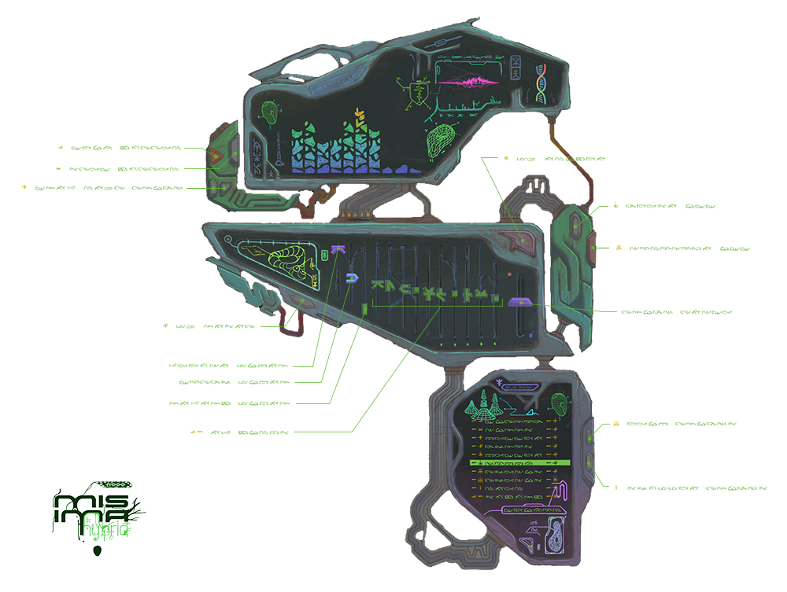

# MI$IM∆ hybrid player

[english](README.en.md) · русский

всё началось с эстетики Winamp. 65 000 скинов. цифровой фольклор. авторская свобода в чистом виде. MI$IM∆ пожил в чужой шкуре, потом собрал свой плеер. никаких скучных окон. никаких html-виджетов. рисованные модули, светящиеся линии, внутри — rust, занимающийся dsp в реальном времени. играет mp3, flac, wav, ogg. визуализация звука. MI$IM∆ живёт внутри арта.

**[открыть в браузере](https://schrab.github.io/misima-hybrid-player/)** — тот же скин, тот же DSP, ничего ставить не надо.

**[скачайте последний релиз](https://github.com/schrab/misima-hybrid-player/releases/latest)** — `.msi` / `.exe` для windows, один универсальный `.dmg` для macos и `.deb` / `.rpm` / `.AppImage` для linux. (сборка macos не подписана — для первого запуска нужен правый клик → открыть; два шага описаны в [DEVELOPMENT.md](DEVELOPMENT.md).)

### благодарности

- четыре трека, идущие в комплекте с веб-версией, взяты с альбома [*Once*](https://witchu.bandcamp.com/album/once) **[Wit Chu](https://witchu.bandcamp.com)** и используются с его разрешения. спасибо, Антон.
- скин, иконки и вообще всё, что на экране: MI$IM∆.
- ревербератор — порт [Mutable Instruments Clouds](https://github.com/pichenettes/eurorack) авторства Emilie Gillet, умчавшейся в рассвет с капибарой на заднем сиденьи веспы (MIT, © 2014).

MI$IM∆ в других местах: [Instagram](https://www.instagram.com/misima.gibrid/) · [Telegram](https://t.me/misimahybrid). обновления появляются здесь раньше всего, а эксперименты с кодом публикуются до того, как добираются до репозитория.

---

## Что умеет

- **Скин и есть интерфейс**: никакого системного декора. весь плеер — рисованные прозрачные модули, работающие ручки и кнопки и собственный битмапный шрифт. каждый пиксель нарисован MI$IM∆.
- **Играет MP3, FLAC, WAV, OGG**: нативное декодирование, ресемплинг под частоту выходного устройства.
- **Бит-в-бит**: на скорости 1.0x и питче 0 st dsp отходит в сторону полностью. 100% оригинального мастера. MI$IM∆ уважает мастера.
- **Скорость и питч — отдельные фейдеры**: темп 0.5x–2.0x, питч ±12 st. за ними два движка, выбираемые автоматически по положению фейдера: фазовый вокодер там, где нужен гладкий звук, WSOLA-растяжитель там, где нужен чистый. ни полого фленжа. ни гребёночной фильтрации. MI$IM∆ проверил. MI$IM∆ одобряет.
- **10-полосный эквалайзер**: меняйте тон звука на ходу — десять полос, от тёплого низа до воздушного верха.
- **Резонансный мастер-фильтр**: на месте фейдера громкости теперь 4-полюсный ФНЧ (24 дБ/окт, с лёгким резонансом). верхнее положение — полностью открыт и не влияет на звук; дальше фейдер плавно уводит сигнал от чистого к полностью обработанному без провалов по громкости во всём диапазоне — до почти закрытых 30 Гц. громкость теперь живёт в системном микшере — MI$IM∆ лепит только тон.
- **Стерео-реверб**: порт [Mutable Instruments Clouds](https://github.com/pichenettes/eurorack). фейдер микса ведёт от сухого сигнала до полностью влажного при совпадающей громкости — без провалов по дороге.
- **Живые визуализаторы**: 10-полосный спектр, зажигающий рисованные сегменты, спрайтовые анимации, тёплые бусины света, текущие по проводам, и 226-точечный осциллограф с затухающим шлейфом.
- **Переключение треков без заиканий**: щёлкайте по плейлисту так быстро, как успевает мышь; декодирования не пересекаются, звук не спотыкается. (MI$IM∆ выучил этот урок на своей шкуре. см. [`CHANGELOG.md`](CHANGELOG.md).)
- **Один DSP, две среды**: браузерная сборка исполняет тот же rust dsp, скомпилированный в wasm.
- **Windows, Linux, macOS — и браузер** (таблица ниже).

---

## Управление

- **Фейдеры**: клик и перетаскивание любого вертикального фейдера.
- **Колесо мыши на фейдерах**: прокрутка меняет значение (`Shift` + прокрутка — точная подстройка).
- **Зум интерфейса**:
  - `Ctrl` / `Cmd` + `+` / `=`: увеличить (пресеты: 75% [562×772], 100% [750×1030], 150% [1125×1545], 200% [1500×2060]).
  - `Ctrl` / `Cmd` + `-` / `_`: уменьшить.
  - `Ctrl` / `Cmd` + `0`: вернуть стандартные 100% (750×1030).
  - `Ctrl` / `Cmd` + `D`: переключить двойной размер (200%, нативный артборд 1:1) и стандарт (100%).
  - `Ctrl` + **колесо мыши**: зум по пресетам.
  - **Автоподгонка**: при запуске проверяется доступная высота экрана; на дисплеях ниже 1050 px (например, ноутбуки с масштабированным 1080p) плеер открывается в компактном режиме 75%, чтобы не вылезти за экран. (MI$IM∆ вылезал за экраны. зрелище то ещё.)
- **Плейлист**: одиночный или двойной клик по строке — трек играет сразу.
- **Прокрутка плейлиста**: колесо мыши над плейлистом, если треков больше 10.
- **Правая кнопка мыши**: отключена — канвас это арт, и меню браузера «сохранить картинку / инспектировать» никогда не бывает тем, что нужно. у ссылок благодарностей своё меню остаётся, так что их можно скопировать или открыть в новой вкладке.
- **Клавиши транспорта и позиционирования** (когда окно плеера в фокусе, без модификаторов):
  - `1`…`9`: прыжок на 10 %…90 % текущего трека и воспроизведение с этого места.
  - `0`: вернуться в начало.
  - `Пробел`: play/pause.
  - `←` / `→`: перемотка на ∓10 секунд.
  - `z` / `x`: предыдущий / следующий трек.
- **FX вкл/выкл**: главный тумблер эквалайзера, реверба и питч-обработки.
- **Сброс FX**: эквалайзер в 0 dB, реверб в 0%, питч в 0 st, скорость в 1.0x.
- **Кнопка питания**: корректное завершение работы.

все клавиши, которые слушает плеер, — на одной доске. транспорт и позиционирование
(`1`…`9`, `0`, `пробел`, `←`/`→`, `z`/`x`) — просто клавиши; зум — с `Ctrl`
(`Cmd` на macos) и `-`, `+`, `0` или `D`.

---

## Платформы

| Платформа | Статус |
|---|---|
| **Windows 11** | **протестировано и подтверждено** |
| **Linux** (X11 и Wayland) | проверено |
| **macOS** | проверено |
| **Браузер** | **выпущено** |

---

## Документация

- [`DEVELOPMENT.md`](DEVELOPMENT.md) — технический спутник этой страницы: стек, схемы аудио-конвейера, система координат скина, сборка и окружение разработки, заметки по платформам. всё слишком тяжёлое для ридми живёт там.
- [`AGENTS.md`](AGENTS.md) — архитектурные правила и ростер агентов (`coder`, `reviewer`, `tester`, `debugger`, `research`, `documenter`).
- [`docs/DSP.md`](docs/DSP.md) — разбор аудиодвижков: сигнальная цепь, WSOLA против фазового вокодера, топология реверба и политика громкости. читать до того, как трогать `src/audio/`. MI$IM∆ настаивает.
- [`docs/WEB-PORT.md`](docs/WEB-PORT.md) — браузерный порт, фаза за фазой, включая три бага, прошедшие все автотесты.
- [`CHANGELOG.md`](CHANGELOG.md) — история вех. (шрамы задокументированы.)
- [`docs/compose/spec/`](docs/compose/spec/) — исторические спецификации и проектные решения.

сон — для скомпилированных.
