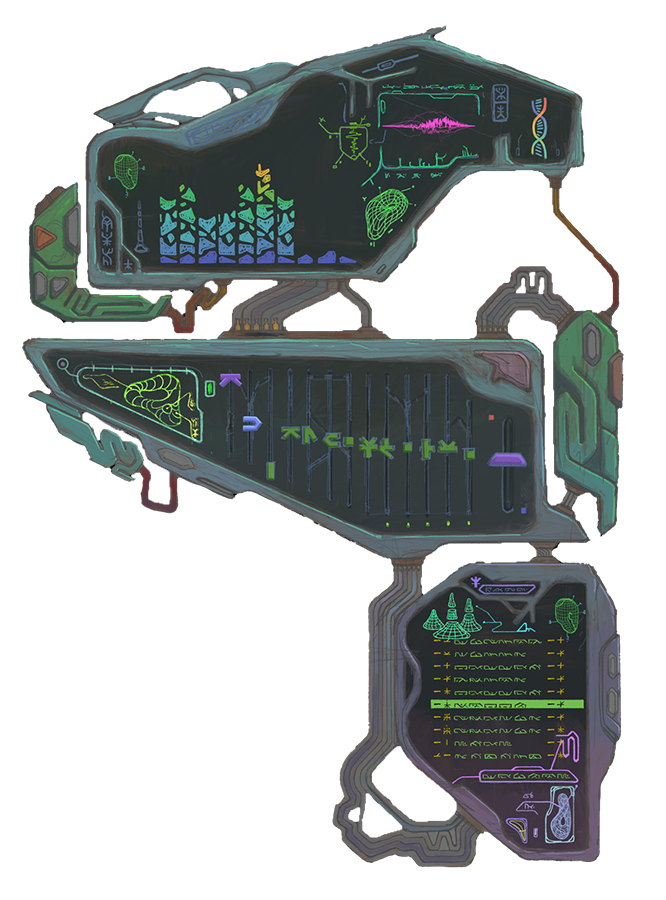

# MI$IM∆ hybrid player



the pig built a music player. no boring window frames. no html widgets. hand-drawn plates, glowing wireframes, and rust doing real-time dsp underneath the skin. it plays mp3, flac, wav, ogg. it has visualizers. the pig lives inside the art.

[](https://www.rust-lang.org/)
[](https://tauri.app/)
[](https://www.typescriptlang.org/)
[](LICENSE)

---

## Key Features

- **Custom Organic Sprite UI**: no generic os chrome. the whole interface is hand-drawn transparent png plates, interactive knobs, button overlays and a custom bitmap glyph font engine. (the pig's skin is literally the skin.)
- **Real-Time DSP Engine**:
  - **Bit-Perfect Studio Bypass**: at 1.0x speed and 0 st the dsp steps aside completely. 100% original master. the pig respects the master.
  - **Dual Time/Pitch Engines**: a stereo phase vocoder handles pitch-up — the region where overlap-add time-stretchers go granular — and a WSOLA time-stretcher handles tempo and pitch-down. picked automatically per fader position. 4-point catmull-rom resampling sets the final pitch, with dynamic anti-alias filtering on upward shifts.
  - **High-Fidelity WSOLA Time-Stretcher**: waveform similarity overlap-add with mono-sum cross-correlation phase alignment. no hollow flanging. no comb filtering. the pig tested. the pig approves.
  - **10-Band Peaking Equalizer**: high-precision RBJ biquads with in-place coefficient updates. drag the faders mid-song and nothing clicks.
  - **Stereo Feedback-Delay Reverb**: Dattorro/Griesinger topology ported from [Mutable Instruments Clouds](https://github.com/pichenettes/eurorack) (MIT, © 2014 Emilie Gillet — the pig says thank you, emilie). four allpass input diffusers feeding two cross-coupled feedback loops, slow LFO shimmer on the first diffuser and the long delays. two decorrelated output taps, so the tail has real stereo width instead of the dead-centre image a mono Schroeder tail gives. `f32` delay storage, layout recomputed per sample rate (44.1/48/96 kHz). the wet tail is gain-normalized against a dry-signal level follower, so the mix fader sweeps from dry to **full wet at matched loudness** (100% = wet-only) without the volume dips of a naive crossfade.
  - **Master FX Toggle & Reset**: one button. all effects. off they go.
- **Dynamic Visualizers**:
  - **Organic Raster Spectrum**: 10 bands that light up irregular hand-drawn segment chips, not boring rectangles. +3 dB/octave display tilt (low bins carry far more raw energy), idle noise gating, and per-band `xShift` so whole columns move with one number.
  - **Sprite-Sheet Animations**: looping artboard animations sliced from uniform-grid sheets, composited in screen blend mode over the background.
  - **Waveform Echo Scope**: 226-point real-time polyline oscilloscope with an 8-frame fading trail and hann envelope windowing.
- **Multi-Format Playback**: native decoding of MP3, FLAC, WAV and OGG via Symphonia, resampled to the hardware output rate.
- **Asynchronous, Glitch-Free Track Switching**: generation-indexed decode queue (`load_gen`) and DSP buffer flush (`seek_gen`). rapid track skips never overlap, never stutter. (the pig learned this one the hard way. see the changelog.)
- **Multiplatform Architecture**: Tauri 2 on Windows 11, Linux (X11 & Wayland) and macOS.

---

## Technical Stack

| Layer | Technologies | Role |
|---|---|---|
| **Desktop Shell** | [Tauri 2](https://tauri.app/) | Native windowing (transparent, frameless), custom drag regions, system dialogs |
| **Backend Core** | Rust 2021 | Audio pipeline, multi-format decoding, real-time DSP, IPC command handlers |
| **Audio I/O** | [cpal](https://crates.io/crates/cpal) | Cross-platform hardware audio stream management |
| **Audio Decoding** | [Symphonia](https://crates.io/crates/symphonia) | Pure-Rust decoding for MP3, FLAC, WAV, OGG/Vorbis, PCM |
| **DSP & Analysis** | [rustfft](https://crates.io/crates/rustfft), custom biquads | 1024-point FFT spectrum analysis, 10-band peaking EQ, Clouds-style feedback-delay reverb |
| **Frontend UI** | TypeScript, Canvas 2D, Vite | 60 FPS sprite compositor, bitmap glyph font, pointer capture fader math |

---

## UI & Coordinate System

- **Artboard Reference**: everything in `skin.json` is measured in **Photoshop 2x artboard pixels (1500×2060)**. measure twice. place once.
- **Display Target**: pixel-perfect at **750×1030 device pixels** on 1080p and 4K.
- **Knob Sizing**: knob and button sprites render at their natural pixel size. always. the art is pixel art; scaling it is disrespect.
- **Display Resolution Scaling**: resizing accounts for `window.devicePixelRatio`. DPI changes trigger a canvas refit without a page reload (a reload resets active audio fx — the pig does not reload).

### Layout Reference
- **Playlist Area**: `(1028, 1490)`, size `378×310`, 10 visible rows with mouse-wheel scrolling. rows read `NN · NAME···· · MM` (2-digit index, up to 6 title glyphs with filename index prefixes stripped, minutes-only duration).
- **Status Indicator**: `(1153, 1817)`, width `220`.
- **Echo Scope**: `(911, 180)`, size `226×142`.
- **Bitmap Font Atlas**:
  - Digits (24×24) at origin `(0, 0)`
  - Symbols (24×18) at origin `(0, 72)` — the symbol band is currently empty art; symbol glyphs render invisible
  - Letters (36×18) at origin `(0, 120)`, rows 0–3

### Skin Layers & Animation (skin.json)
- **`background.overlays[]`**: still png layers composited above the background plate, below all controls (e.g. `bg/UI_highlights.png`). animated regions are erased from the layer art by the artist; the engine draws overlays unmasked. (no engine-side masking. the artist owns the mask.)
- **`animations[]`**: sprite-sheet loops. uniform grid (`grid.cols/rows`), real `frames` count (trailing empty cells allowed), `origin` = top-left of frame 0 on the 2× artboard, optional `size` to scale cells in code (omit = native), `fps`, `blend: "screen"` (default — drops solid black sheet backgrounds), `playback: "always" | "on-playing"`.
- **`visuals.spectrum.bands[].xShift`**: whole-column X nudge (artboard px) applied to every segment of that band at draw time.
- **Spectrum chip set variations**: bands don't share one chip pool — each band's 10 segments can reference any freeform-size chip png (`spectrum/chip_*.png`). the current layout cycles three tuned variants across the columns (`chip_1_*` / `chip_2_*` / default `chip_*`). to retune: adjust one band's segment origins, then clone to the others **anchor-relative** (keep each column's own left edge and `xShift`, copy the variant's Y-stack and X jitter). display energy tilt lives in `BAND_GAIN` (`main.ts`), not in rust. the pig checked twice.

---

## Audio Pipeline & Performance

```
Decoded PCM (Symphonia)
      │
      ▼
Interleaved Resampler (Device Rate: 44.1k / 48k / 96k)
      │
      ▼
[Bypass Check: Speed == 1.0 && Pitch == 0.0] ──► (Bit-perfect direct PCM transfer)
      │ (if FX active)
      ▼
Stretcher (Speed: 0.5x – 2.0x, Pitch: ±12 st)
      ├─ stretch ≤ 1 → Stereo Phase Vocoder (pitch-up, smooth partials)
      └─ stretch > 1 → WSOLA Time-Stretcher (tempo + pitch-down)
      │
      ▼
Cubic Hermite Resampler + Anti-Alias Lowpass
      │
      ▼
10-Band Peaking Biquad EQ (60 Hz – 16 kHz)
      │
      ▼
Clouds-Style Stereo Reverb (FDN, Modulated, Envelope-Normalized Wet, Dry→Wet Crossfade)
      │
      ▼
Hardware Output Stream (cpal) ──► Spectrum Analyzer (rustfft) ──► Canvas Visuals
```

the horse said one time-stretcher was enough. the barn overruled. (the barn IS the horse. denial is structural.) both engines have a job: the vocoder is smooth where the wsola goes granular (pitch-up, 4x grain overlap at +1 octave — the pig measured), and the wsola is cheap and clean where it expands (tempo, pitch-down). the full reasoning, the failure modes and the numbers live in [`docs/DSP.md`](docs/DSP.md). read it before touching `src/audio/`. the pig means it.

### Audio Performance Invariants
1. **Zero Steady-State Allocations**: processing vectors (`bl`, `br`, `mono_scratch`, `fifo_l`, `fifo_r`) are pre-allocated and reused. allocation on the audio thread makes the bones creak. the bones do not creak here.
2. **Hoisted Mutex Locks**: `eq`, `reverb`, `reverb_mix` are acquired once per callback block, not per sample — lock contention drops from ~3,000 acquisitions/buffer to 2.
3. **Click-Free EQ**: `EqState::set_gains` modifies biquad coefficients in-place while preserving the delay registers (`z1`, `z2`, `z1r`, `z2r`). no pops. no clicks. MALLOC SAYS NOTHING, FOR ONCE.
4. **Async Race-Free Loading**: `player::prepare_load()` bumps the generation counters (`load_gen`, `seek_gen`) and silences the previous track instantly. rapid track skips never overlap or stutter.
5. **Saturating WSOLA FIFO Bookkeeping**: the resampler read position can legally run past the FIFO length near track end (overreads are zero-padded); all length arithmetic around `fifo_read_pos` must stay saturating/clamped. an unchecked `usize` underflow here panics the audio thread and kills output. the pig warned you. the pig always warns you.

---

## Multiplatform Support

| Platform | Status | Audio Backend | Window / Compositing Notes |
|---|---|---|---|
| **Windows 11** | **Tested & Verified** | WASAPI | Frameless, transparent window, DPI scaling supported |
| **Linux** | **In Progress** | ALSA / PipeWire / PulseAudio | Requires compositing window manager for transparency. Wayland uses `xdg_toplevel.move()` for dragging. |
| **macOS** | **Verified (dev)** | CoreAudio | Frameless transparent window (requires `macOSPrivateApi`), Cmd+scroll zoom, 44.1/48 kHz playback |

platform-specific troubleshooting and development guidelines: [`agents.md`](agents.md).

---

## Controls & Interaction

- **Fader Drag**: click and drag any vertical fader.
- **Mouse Wheel on Faders**: scroll to adjust (`Shift` + scroll for fine adjustment).
- **UI Zoom / Scaling**:
  - `Ctrl` / `Cmd` + `+` / `=`: zoom in (presets: 75% [562×772], 100% [750×1030], 150% [1125×1545], 200% [1500×2060]).
  - `Ctrl` / `Cmd` + `-` / `_`: zoom out.
  - `Ctrl` / `Cmd` + `0`: reset to 100% standard size (750×1030).
  - `Ctrl` / `Cmd` + `D`: toggle double size (200% native 1:1 artboard) vs standard (100%).
  - `Ctrl` + **Mouse Wheel**: zoom across scale presets.
  - **Auto-Fit**: checks available display height on launch; screens under 1050px (e.g. 1080p scaled laptops) open in compact 75% mode so the player does not fall off the screen. (the pig has fallen off screens. it is not dignified.)
- **Playlist Navigation**: single-click or double-click any track row to play immediately.
- **Playlist Scrolling**: mouse wheel over the playlist for libraries with more than 10 tracks.
- **FX Enable / Bypass**: toggles master EQ, reverb and pitch processing.
- **FX Reset**: EQ to 0 dB, reverb to 0%, pitch to 0 st, speed to 1.0x.
- **Power Button**: clean application shutdown.

---

## Development & Build

### Prerequisites
- Node.js (v20+) and npm
- Rust toolchain (stable) with Cargo (`curl --proto '=https' --tlsv1.2 -sSf https://sh.rustup.rs | sh`)
- OS dependencies:
  - **Linux (Debian/Ubuntu)**: `sudo apt install libwebkit2gtk-4.1-dev build-essential curl wget file libxdo-dev libssl-dev libayatana-appindicator3-dev librsvg2-dev libasound2-dev`
  - **Windows**: WebView2 (pre-installed on Windows 10/11), C++ build tools

### Running in Development

```bash
# Clone the repository
git clone https://github.com/schrab/misima-hybrid-player.git
cd misima-hybrid-player/app

# Install frontend dependencies
npm install

# Launch Tauri development mode (hot-reload for frontend and backend)
npm run tauri dev
```

### Running Tests

```bash
# Execute Rust backend unit and DSP tests (39/39 tests)
cd app/src-tauri
cargo test -- --nocapture

# Live CoreAudio smoke test (requires a real output device; #[ignore]d by default)
cargo test coreaudio_smoke -- --ignored --nocapture

# Typecheck frontend code
cd ../app
npx tsc --noEmit
```

### Building for Release

```bash
cd app
npm run tauri build
```

Installable bundles (MSI/NSIS on Windows, DEB/AppImage on Linux, DMG on macOS) land under `app/src-tauri/target/release/bundle/`.

### Installing on macOS (unsigned build)

GitHub Releases carry an unsigned, unnotarized DMG (`Misima Hybrid Player_*_aarch64.dmg`, Apple Silicon, macOS 11+). no Developer ID signature, so Gatekeeper blocks the first launch. to install:

1. Open the DMG and drag `Misima Hybrid Player.app` to Applications.
2. **Right-click (Ctrl-click) the app → Open → Open** in the dialog. this whitelists it permanently; double-click works from then on.

Alternative (Terminal): `xattr -d com.apple.quarantine "/Applications/Misima Hybrid Player.app"`.

---

## Project Structure & Agents

the pig keeps the paperwork too.

- [`agents.md`](agents.md) — architectural guidelines, subagent definitions (`coder`, `reviewer`, `tester`, `debugger`, `research`, `documenter`), development invariants.
- [`docs/DSP.md`](docs/DSP.md) — deep-dive on the audio engines: signal chain, WSOLA vs phase vocoder, reverb topology and loudness policy, invariants, test methodology. **read before touching `src/audio/`.** the pig means it.
- [`HANDOFF.md`](HANDOFF.md) — quick-reference: the hard "do not" list, layout coordinates, skin layers, font atlas.
- [`CHANGELOG.md`](CHANGELOG.md) — milestone history with commit references. (scars, documented.)
- [`docs/compose/spec/`](docs/compose/spec/) — historical feature specifications and design decisions.

sleep is for the compiled.
